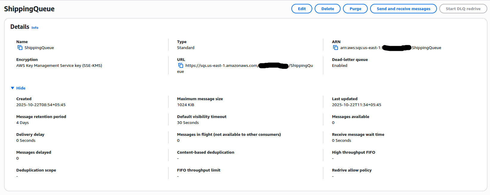

# 🛒 Event-Driven E-commerce System on AWS

> **An end-to-end microservices-based, event-driven e-commerce backend built entirely with AWS CloudFormation (raw YAML)**  
> *Designed, implemented, and deployed during Tihar 2025 — Nepal’s festival of lights 🎉*

---

## ✨ Project Overview

This project implements a **serverless, event-driven e-commerce order processing system** using **AWS-native services**.  
It’s designed to demonstrate how **microservices communicate asynchronously via events** rather than direct API calls — enabling **scalability, decoupling, and resilience**.

While most of my past work focused on **monolithic REST APIs**, this project represents my deep dive into:
- **Event-driven design patterns**
- **Microservice architecture**
- **Infrastructure as Code (IaC)** using *pure CloudFormation YAML* (no SAM, no CDK, no Terraform)

> ⚙️ The main focus is on AWS architecture, infrastructure automation, and operational maturity — not UI or front-end functionality.

---

## 🧱 Tech Stack Overview

| Category | AWS Service(s) | Notes |
|-----------|----------------|-------|
| **IaC** | CloudFormation (YAML) | Full deployment with exports/imports — no abstractions |
| **Compute** | AWS Lambda (x5) | Stateless microservices handling distinct workflows |
| **Storage** | DynamoDB (x4) | One table per service, with PITR and KMS-based SSE |
| **Integration & Routing** | API Gateway, EventBridge | Event-driven service communication |
| **Buffering & Reliability** | SQS (x4 + DLQs) | Message decoupling and retry handling |
| **Notifications** | SNS (x1) | User and Ops alerts |
| **Observability** | CloudWatch | Logs, metrics, alarms for all services |
| **Security & Encryption** | KMS (CMK) | Custom-managed key for encryption across resources |

---

## 🏗️ System Architecture


1. **Order Service** receives orders through API Gateway and publishes an `OrderPlaced` event.
2. **Inventory Service** validates stock and responds with a `StockConfirmation` event.
3. **Payment Service** simulates payment and publishes a `PaymentConfirmation` event.
4. **Shipping Service** fulfills successful orders and uses DLQs for failed shipments.
5. **SNS Topics** notify customers or ops teams on failures or alerts.

---

## 🧩 Microservice Breakdown

### 🏗️ a) Base Infrastructure Stack

Defines:
- **KMS CMK** → Used by SNS, SQS, DynamoDB, EventBridge, and CloudWatch  
- **EventBridge Bus (EcomEventBus)** → Central event router for all services  
- **OpsAlertTopic (SNS)** → Encrypted operations alerting topic  

> Using a CMK gave me a hands-on understanding of KMS concepts like key policies, service principals, and key rotation — something that clicked only after implementing it.

| Resource | Type | Description |
|-----------|------|-------------|
| MyKmsKey | `AWS::KMS::Key` | Customer-managed key with rotation |
| EcomEventBus | `AWS::Events::EventBus` | Central event backbone |
| OpsAlertTopic | `AWS::SNS::Topic` | Encrypted SNS topic for Ops alerts |

---

### 🧾 b) Order Stack

Handles both **API requests** and **event processing**.

#### Features:
- `OrdersTable` (DynamoDB) for order state
- `OrderLambda` for processing HTTP + event-based input
- `API Gateway` exposure via POST `/orders`
- EventBridge rules for order lifecycle updates

#### OrderLambda Responsibilities:
1. Accept new orders (HTTP)
2. Validate and persist to DynamoDB
3. Publish `OrderPlaced` events
4. React to `StockConfirmation`, `PaymentConfirmation`, `ShipmentCreated` events


<center><p>Order service components — Lambda, DynamoDB, and API Gateway</p></center>

---

### 📦 c) Inventory Stack

Handles inventory updates and rollback using **SQS buffering** and **compensation logic**.

#### Key Highlights:
- `InventoryTable` with conditional updates to avoid negative stock
- `InventoryQueue` (SQS) for async processing
- `InventoryLambda` for stock check, rollback, and event publishing
- `InventoryCompensationQueue` for handling payment failures

#### Event Flows:
- On order placed → validate stock → publish `StockConfirmation`
- On payment failure → trigger compensation via rollback queue


---

### 💳 d) Payment Stack

Simulates payment flow and failure recovery.

#### Components:
- `PaymentTable` (DynamoDB) with PITR + KMS SSE
- `PaymentQueue` (SQS)
- `PaymentLambda` → processes payment, publishes success/failure events
- `PaymentFailureTopic` (SNS) → customer notifications
- CloudWatch Alarm → triggers Ops alerts for Lambda errors

#### Logic:
- Consumes `stockConfirmed: true` events  
- Randomly simulates payment outcomes  
- On failure → triggers compensation and customer alert  


---

### 🚚 e) Shipping Stack

Final stage — responsible for fulfillment and reliability handling via DLQs.

#### Components:
- `ShippingTable` (DynamoDB)
- `ShippingQueue` (SQS)
- `ShippingDLQ` (Dead Letter Queue)
- `ShippingLambda` for creating shipments
- `DLQProcessorLambda` for reprocessing failed shipments
- CloudWatch Alarms for DLQ message count

#### Flow:
- On payment success → enqueue shipping task  
- On processing failure → message retries → DLQ → reprocessing  
- Ensures *exactly-once delivery semantics* using idempotent updates  



---

## 🧠 Key Learnings

| Concept | Realization |
|----------|--------------|
| **Event-driven design** | True decoupling — services evolve independently |
| **KMS CMK** | Deep understanding of encryption, IAM policies, and key rotation |
| **CloudFormation YAML** | Low-level clarity on dependencies and cross-stack communication |
| **SQS + DLQ patterns** | Hands-on reliability engineering |
| **CloudWatch Monitoring** | Built confidence in operational awareness and alerting setup |

---

## 🚀 Deployment

All resources are deployed using **pure CloudFormation YAML**, organized by stacks:

| Stack | Description |
|--------|--------------|
| `base-infra.yaml` | KMS, EventBus, SNS |
| `order-stack.yaml` | API Gateway, Orders Lambda + Table |
| `inventory-stack.yaml` | SQS Queues, Lambda, Table |
| `payment-stack.yaml` | Payment flow, Alarms, SNS |
| `shipping-stack.yaml` | Shipping + DLQ handling |

To deploy:
```bash
chmod+x deploy_stacks.sh
./deploy_stacks.sh

To destroy:
```bash
chmod+x destroy_stacks.sh
./destroy_stacks.sh
